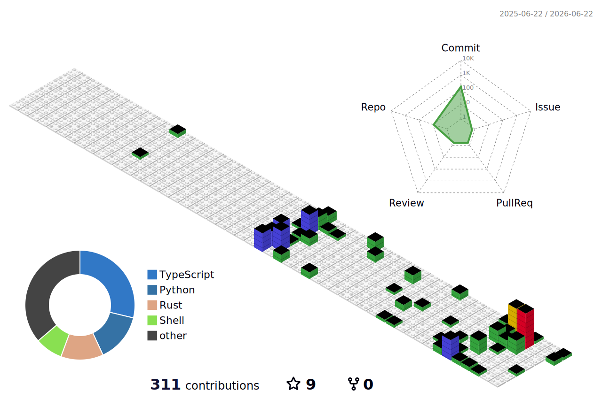

 

<h1 align="center">
  
  𝐇𝐞𝐥𝐥𝐨, 𝐈'𝐦 𝐄𝐫𝐞𝐧! 🐢
  
</h1>

<p align="center">
  
</p>

<p align="center">
  Software Engineering student at the University of Europe for Applied Sciences, Potsdam.<br/>
  I build end-to-end data pipelines with Python & SQL, automate real-world workflows with n8n,<br/>
  and work with LLMs and AI tooling to explore what's possible.<br/>
  Focused on writing clean, production-quality code — and always building something new.
</p>

<p align="center">
  <a href="mailto:taskineren24@gmail.com">
    
  </a>
</p>

<p align="center">
  
  
  
</p>


- 🔭 I’m currently working on **data pipelines, automation workflows, and AI tooling.**
- 🌱 I’m striving to learn new things every day.
- 💬 Ask me about **Python, automation, or AI tools** — feel free to reach out via [email](mailto:taskineren24@gmail.com)!
- ⚡ Fun fact: **I really love turtles! 🐢**

<br>


# Connect  

[](https://github.com/AarontheGalaxy)
[](https://linkedin.com/in/eren-taşkın)
[](mailto:taskineren24@gmail.com)

<br>


# Skills  

**Languages & Tools**

<p align="center">
  <a href="https://skillicons.dev">
    
  </a>
</p>

**AI & Machine Learning**

<p align="center">
  
  
  
  
  
  
</p>

**Systems & Security**

<p align="center">
  
  
  
  
  
</p>

**Software Development**

<p align="center">
  
  
  
</p>

<p align="center">
  <a href="https://www.linkedin.com/in/eren-taşkın-7b6229350/details/certifications/">
    
  </a>
</p>


<br>

# Featured Projects 🏆

<table align="center">
  <tr>
    <td align="center" width="50%">
      <a href="https://github.com/AarontheGalaxy/Retail-KPI-Root-Cause-Analysis">
        <br/>
        
        
        
      </a>
      <p><sub>End-to-end 4-phase data pipeline processing 105K+ retail records with anomaly detection</sub></p>
    </td>
    <td align="center" width="50%">
      <a href="https://github.com/AarontheGalaxy/Python-Text-Analyzer">
        <br/>
        
        
        
      </a>
      <p><sub>Desktop NLP tool with dual-architecture (Functional & OOP), multi-format file support</sub></p>
    </td>
  </tr>
</table>


# My GitHub Stats 

<p align="center">
  
</p>


<br>

## 🧊 3D GitHub Contribution Graph

<div align="center">
  
</div>

## 🐍 Contribution Snake (Snake Animation)

<div align="center">
  <picture>
    <source media="(prefers-color-scheme: dark)" srcset="https://raw.githubusercontent.com/AarontheGalaxy/AarontheGalaxy/output/github-contribution-grid-snake-dark.svg">
    <source media="(prefers-color-scheme: light)" srcset="https://raw.githubusercontent.com/AarontheGalaxy/AarontheGalaxy/output/github-contribution-grid-snake.svg">
    
  </picture>
</div>

# Wakatime Stats 

<!--START_SECTION:waka-->


**🐱 My GitHub Data** 

> 📦 20.0 kB Used in GitHub's Storage 
 > 
> 🏆 105 Contributions in the Year 2026
 > 
> 💼 Opted to Hire
 > 
> 📜 4 Public Repositories 
 > 
> 🔑 10 Private Repositories 
 > 
**I'm a Night 🦉** 

```text
🌞 Morning                8 commits           █░░░░░░░░░░░░░░░░░░░░░░░░   03.59 % 
🌆 Daytime                35 commits          ████░░░░░░░░░░░░░░░░░░░░░   15.70 % 
🌃 Evening                91 commits          ██████████░░░░░░░░░░░░░░░   40.81 % 
🌙 Night                  89 commits          ██████████░░░░░░░░░░░░░░░   39.91 % 
```
📅 **I'm Most Productive on Thursday** 

```text
Monday                   18 commits          ██░░░░░░░░░░░░░░░░░░░░░░░   08.07 % 
Tuesday                  23 commits          ███░░░░░░░░░░░░░░░░░░░░░░   10.31 % 
Wednesday                9 commits           █░░░░░░░░░░░░░░░░░░░░░░░░   04.04 % 
Thursday                 66 commits          ███████░░░░░░░░░░░░░░░░░░   29.60 % 
Friday                   14 commits          ██░░░░░░░░░░░░░░░░░░░░░░░   06.28 % 
Saturday                 60 commits          ███████░░░░░░░░░░░░░░░░░░   26.91 % 
Sunday                   33 commits          ████░░░░░░░░░░░░░░░░░░░░░   14.80 % 
```


📊 **This Week I Spent My Time On** 

```text
🕑︎ Time Zone: Europe/Berlin

💬 Programming Languages: 
Markdown                 2 mins              ██████████████████████░░░   88.83 % 
Other                    0 secs              ███░░░░░░░░░░░░░░░░░░░░░░   11.17 % 

🔥 Editors: 
VS Code                  2 mins              █████████████████████████   100.00 % 

🐱‍💻 Projects: 
AarontheGalaxy           1 min               ████████████████░░░░░░░░░   62.57 % 
Unknown Project          1 min               █████████░░░░░░░░░░░░░░░░   37.43 % 

💻 Operating System: 
Mac                      2 mins              █████████████████████████   100.00 % 
```

**I Mostly Code in Python** 

```text
Python                   7 repos             ████████████░░░░░░░░░░░░░   50.00 % 
TypeScript               3 repos             █████░░░░░░░░░░░░░░░░░░░░   21.43 % 
HTML                     2 repos             ████░░░░░░░░░░░░░░░░░░░░░   14.29 % 
JavaScript               1 repo              ██░░░░░░░░░░░░░░░░░░░░░░░   07.14 % 
Rust                     1 repo              ██░░░░░░░░░░░░░░░░░░░░░░░   07.14 % 
```


 Last Updated on 17/05/2026 15:31:39 UTC
<!--END_SECTION:waka-->


<h4 align="center">
  
```diff
+@ @ @ @ @ @ @ @ @ @ @ @ @ @ @ @ @ @ @ @ @ @ @ @ @ @ @ @+
@@       o o                                           @@
@@       | |                                           @@
@@      _L_L_                                          @@
@@   ❮\/__-__\/❯ Programming isn't about what you know @@
@@   ❮(|~o.o~|)❯  It's about what you can figure out   @@
@@   ❮/ \`-'/ \❯                                       @@
@@     _/`U'\_                                         @@
@@    ( .   . )     .----------------------------.     @@
@@   / /     \ \    | while( ! (succeed=try() ) ) |    @@
@@   \ |  ,  | /    '----------------------------'     @@
@@    \|=====|/                                        @@
@@     |_.^._|                                         @@
@@     | |"| |                                         @@
@@     ( ) ( )   Testing leads to failure              @@
@@     |_| |_|   and failure leads to understanding    @@
@@ _.-' _j L_ '-._                                     @@
@@(___.'     '.___)                                    @@
+@ @ @ @ @ @ @ @ @ @ @ @ @ @ @ @ @ @ @ @ @ @ @ @ @ @ @ @+
```

</h4>  

<div align="center">

```text
    ___                          __  __         ______      __                
   /   | ____ __________  ____  / /_/ /_  ___  / ____/___ _/ /___ __  ____  __
  / /| |/ __ `/ ___/ __ \/ __ \/ __/ __ \/ _ \/ / __/ __ `/ / __ `/ |/_/ / / /
 / ___ / /_/ / /  / /_/ / / / / /_/ / / /  __/ /_/ / /_/ / / /_/ />  </ /_/ / 
/_/  |_\__,_/_/   \____/_/ /_/\__/_/ /_/\___/\____/\__,_/_/\__,_/_/|_|\__, /  
                                                                     /____/   
```

</div>
