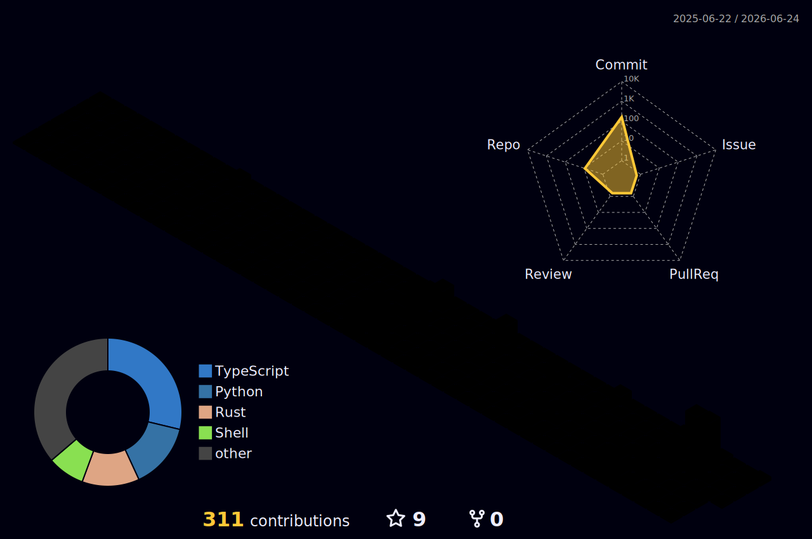

<h1 align="center">Hello, I'm Eren!</h1>

<i>Software Engineering Student &nbsp;·&nbsp; Data Pipelines &nbsp;·&nbsp; AI Tooling &nbsp;·&nbsp; Open to Work</i>

  

  Software Engineering student at the University of Europe for Applied Sciences, Potsdam. 
  I build end-to-end data pipelines with Python & SQL, automate real-world workflows with n8n, 
  and work with LLMs and AI tooling to explore what's possible. 
  Focused on writing clean, production-quality code — and always building something new.

  

  

- 🔭 I'm currently working on **data pipelines, automation workflows, and AI tooling.**
- 🌱 I'm striving to learn new things every day.
- 💬 Ask me about **Python, automation, or AI tools** — feel free to reach out via [email](mailto:taskineren24@gmail.com)!
- ⚡ Fun fact: **I really love turtles! 🐢**

 

---

## Connect

---

## Technical Skills

### Core Skills

<table>
  <thead>
    <tr>
      <th align="left">Category</th>
      <th align="left">Technologies</th>
    </tr>
  </thead>
  <tbody>
    <tr>
      <td><b>Languages</b></td>
      <td>
        
        
        
        
        
      </td>
    </tr>
    <tr>
      <td><b>Databases</b></td>
      <td>
        
        
      </td>
    </tr>
    <tr>
      <td><b>Cloud & Infrastructure</b></td>
      <td>
        
        
        
        
        
      </td>
    </tr>
    <tr>
      <td><b>AI & Automation</b></td>
      <td>
        
        
        
        
        
      </td>
    </tr>
    <tr>
      <td><b>Systems & Security</b></td>
      <td>
        
        
      </td>
    </tr>
    <tr>
      <td><b>Software Development</b></td>
      <td>
        
        
        
      </td>
    </tr>
    <tr>
      <td><b>Tools & IDEs</b></td>
      <td>
        
        
        
        
        
        
        
      </td>
    </tr>
  </tbody>
</table>

### Familiar With

  
  
  
  
  
  
  
  
  
  
  
  

  

---

## Featured Projects

<table align="center">
  <tr>
    <td align="center" colspan="2">
      <a href="https://github.com/AarontheGalaxy/MacBroom">
         
        
        
        
      </a>
      
macOS system cleaner and maintenance tool built with Swift

    </td>
  </tr>
  <tr>
    <td align="center" width="50%">
      <a href="https://github.com/AarontheGalaxy/AI-Tech-Radar">
         
        
        
        
      </a>
      
AI-powered daily tech & AI news aggregator using local LLM (Ollama)

    </td>
    <td align="center" width="50%">
      <a href="https://github.com/AarontheGalaxy/Retail-KPI-Root-Cause-Analysis">
         
        
        
        
      </a>
      
End-to-end 4-phase data pipeline processing 105K+ retail records with anomaly detection

    </td>
  </tr>
</table>

---

## GitHub Statistics

  
  

  

  <picture>
    <source media="(prefers-color-scheme: dark)" srcset="https://raw.githubusercontent.com/AarontheGalaxy/AarontheGalaxy/output/github-contribution-grid-snake-dark.svg">
    <source media="(prefers-color-scheme: light)" srcset="https://raw.githubusercontent.com/AarontheGalaxy/AarontheGalaxy/output/github-contribution-grid-snake.svg">
    
  </picture>

